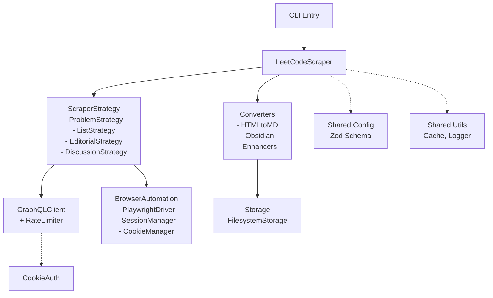
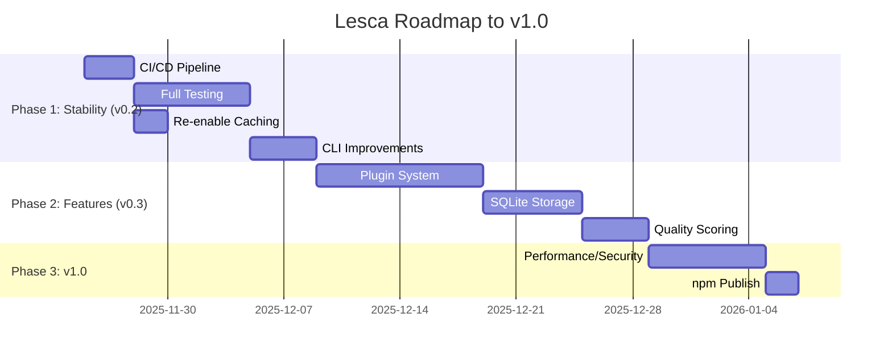

# Lesca Project: Current State Analysis & Next Steps

## Executive Summary

Lesca is a **mature MVP-stage LeetCode scraper** with comprehensive core functionality complete:

- **Core scraping**: Problems, lists, editorials, discussions via GraphQL + browser automation (Playwright).
- **Modular monorepo**: 11 packages (core, scrapers, converters, storage, browser-automation, auth, api-client, cli, converters, shared/\*).
- **Quality metrics**: 631 passing tests, 68-73% coverage (high in most packages, low in CLI), zero TypeScript errors.
- **Production-ready features**: Caching (tiered, TTL), batch scraping with resume/progress, Obsidian/Markdown output, CLI commands.
- **Gaps**: CI/CD missing, integration tests incomplete (TODOs), GraphQL caching needs re-enable, CLI UX (no init/auth), full config integration.

**Status**: **v0.1.0 MVP ✅ → Ready for v0.2.0 Stability**

## Current Architecture



## Codebase Health

| Package            | Coverage | Tests | Status |
| ------------------ | -------- | ----- | ------ |
| api-client         | 98%      | 28    | ✅     |
| auth               | 96%      | 41    | ✅     |
| browser-automation | 96%      | 65    | ✅     |
| cli                | 16%      | 61    | 🚧     |
| converters         | 86%      | 154   | ✅     |
| core               | 82%      | 29    | ✅     |
| scrapers           | 91%      | 105   | ✅     |
| storage            | 91%      | 35    | ✅     |

- **TODOs/FIXMEs**: Minimal (4x in integration tests: mock API responses, partial failures).
- **Key Classes**:
  - `packages/core`: [`BatchScraper`](packages/core/src/batch-scraper.ts), [`LeetCodeScraper`](packages/core/src/scraper.ts)
  - `packages/scrapers`: 4 strategies fully implemented with browser fallbacks.

## Roadmap Alignment



**Docs Consensus on Next**:

1. **CI/CD** (critical blocker)
2. **Testing** (integration E2E, CLI coverage)
3. **Caching** (re-enable in GraphQLClient)
4. **CLI UX** (init, auth, list/search)
5. **Config** (replace hardcodes)

## Proposed Action Plan

```
[ ] 1. Set up CI/CD (GitHub Actions: lint/test/build on PR, full on release)
[ ] 2. Complete integration tests (implement TODOs with mocks/fixtures)
[ ] 3. Re-enable GraphQL caching (api-client)
[ ] 4. CLI enhancements (init/auth commands, interactive prompts)
[ ] 5. Full config integration (audit hardcodes → config.get())
[ ] 6. Publish v0.2.0 to npm
[-] 7. Monitor selectors (daily GitHub Action)
[ ] 8. Performance benchmarks
```

**Estimated Effort**: 3-4 weeks (parallelizable).

**Risks**: LeetCode UI changes (mitigate: selector fallbacks + monitoring).

Approve this plan? Ready to switch to `orchestrator` mode for execution?
