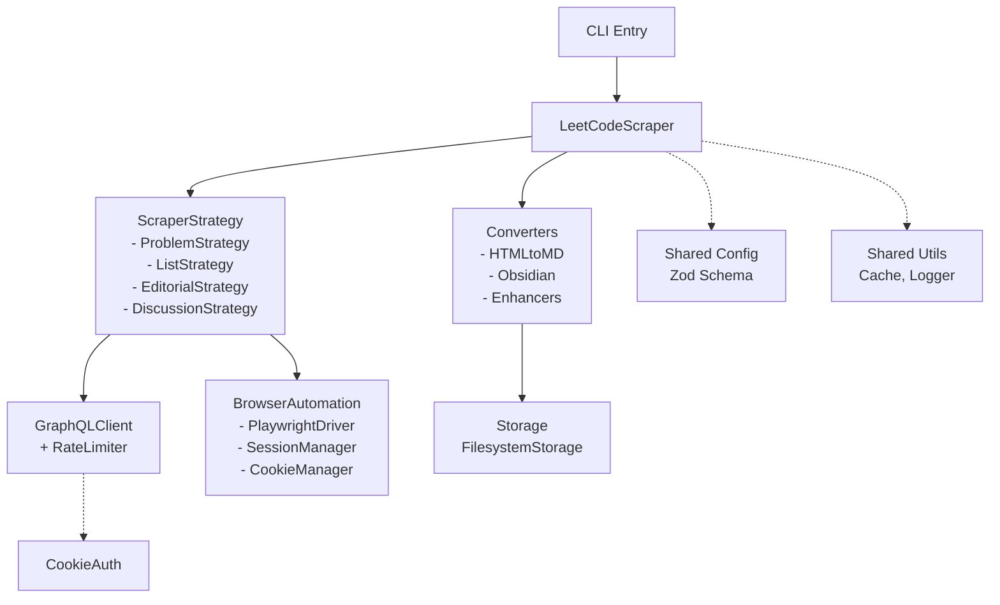
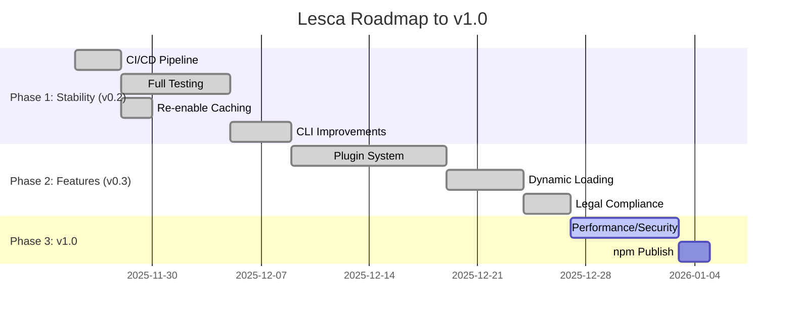

# Lesca Project: Current State Analysis & Next Steps

## Executive Summary

Lesca is a **mature v0.2.0 Beta LeetCode scraper** with comprehensive core functionality complete:

- **Core scraping**: Problems, lists, editorials, discussions via GraphQL + browser automation (Playwright).
- **Modular monorepo**: 11 packages (core, scrapers, converters, storage, browser-automation, auth, api-client, cli, converters, shared/\*).
- **Quality metrics**: High test coverage across all packages (CLI ~84%, others >90%), zero TypeScript errors.
- **Production-ready features**: Caching (tiered, TTL), batch scraping with resume/progress, Obsidian/Markdown output, CLI commands (init, auth, list, scrape).
- **Status**: **v0.2.0 Beta ✅ → Ready for v1.0 Polish**

## Current Architecture



## Codebase Health

| Package            | Coverage | Tests | Status |
| ------------------ | -------- | ----- | ------ |
| api-client         | 98%      | 28    | ✅     |
| auth               | 96%      | 41    | ✅     |
| browser-automation | 96%      | 65    | ✅     |
| cli                | ~84%     | 61+   | ✅     |
| converters         | 86%      | 154   | ✅     |
| core               | 82%      | 29    | ✅     |
| scrapers           | 91%      | 105   | ✅     |
| storage            | 91%      | 35    | ✅     |

- **TODOs/FIXMEs**: Minimal. Most identified TODOs have been resolved or are minor.
- **Key Classes**:
  - `packages/core`: [`BatchScraper`](packages/core/src/batch-scraper.ts), [`LeetCodeScraper`](packages/core/src/scraper.ts)
  - `packages/scrapers`: 4 strategies fully implemented with browser fallbacks.

## Roadmap Alignment



**Next Steps**:

1.  **Performance/Security**: Benchmarking and security audit.
2.  **npm Publish**: Prepare for release.

## Proposed Action Plan

```
[x] 1. Set up CI/CD (GitHub Actions: lint/test/build on PR, full on release)
[x] 2. Complete integration tests (implement TODOs with mocks/fixtures)
[x] 3. Re-enable GraphQL caching (api-client)
[x] 4. CLI enhancements (init/auth commands, interactive prompts)
[x] 5. Full config integration (audit hardcodes → config.get())
[x] 6. Plugin System & Dynamic Loading
[x] 7. Legal Research & Compliance
[ ] 8. Performance benchmarks
[ ] 9. Publish v1.0.0 to npm
```

**Estimated Effort**: 1-2 weeks.

**Risks**: LeetCode UI changes (mitigate: selector fallbacks + monitoring).
